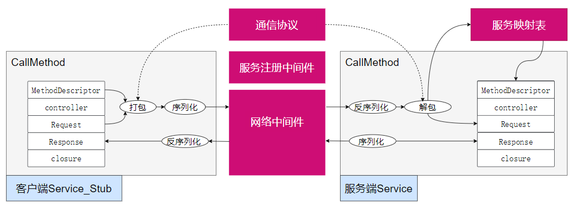
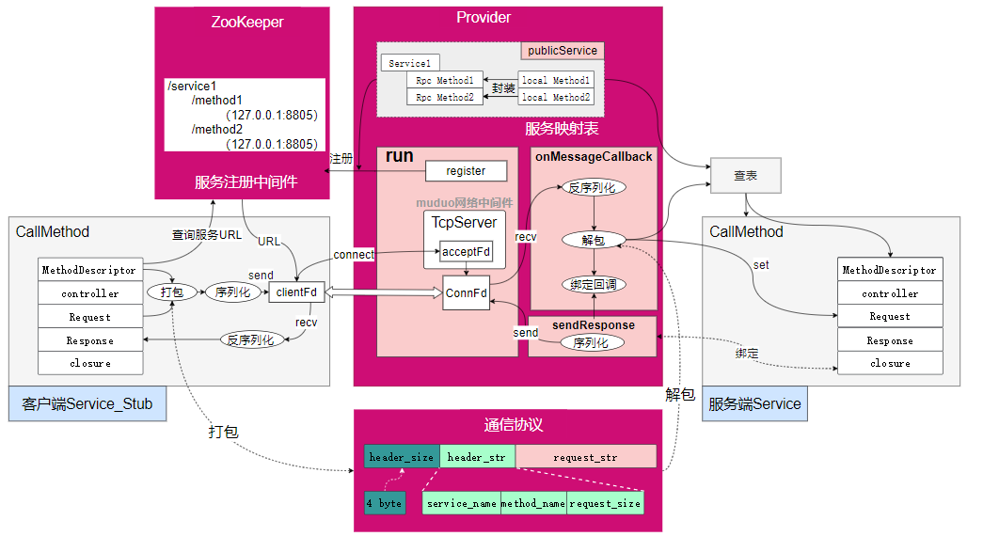
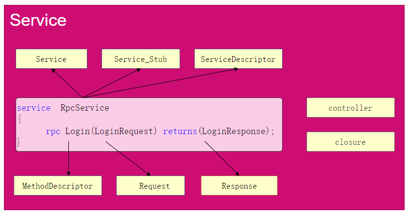
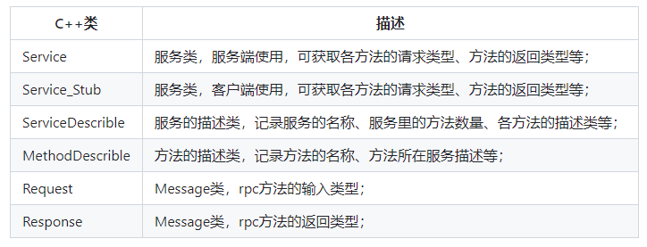
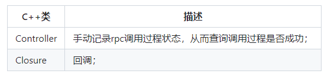
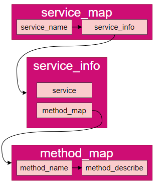
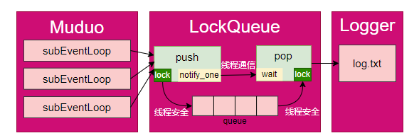
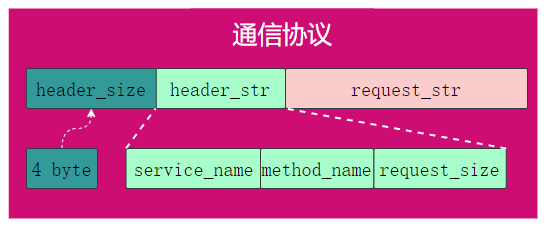

Here is an English translation of the project description for github:

# Project Overview

This project is a microservices RPC framework based on muduo+protobuf+zookeeper. Service providers can register RPC nodes and publish services through the mprpc framework. Clients can discover services through the ZooKeeper service configuration center and make remote method calls.

# Development Environment

1. protobuf 3.11.0  
2. gcc version 7.5.0
3. Zookeeper version: 3.4.10

# Project Build

**Install Dependencies**

- protobuf 
- ZooKeeper
- muduo

**Build**

```shell
git clone https://github.com/timothy020/Rpc_Framework.git
./autobuild.sh
```

The generated header files and dynamic libraries will be placed in the *lib* directory.

# Framework Design

**Design Concept**

Protobuf natively provides an RPC service method calling code framework without implementing descriptions of service interfaces. The focus is on service management and RPC communication processes. Additionally, protobuf uses binary serialization of data, which has higher communication efficiency. Therefore, the initial framework concept is designed based on protobuf as follows:



The gray areas are provided by protobuf, and the red areas are parts to be developed for the framework:

- Service Mapping Table: Records the local service name and service object published by the service provider. When the client initiates a call, it inputs the RPC method name, looks up the table, gets the service object, and calls it.

- Service Registration Middleware: The service provider registers the published services. The client obtains the URL of the machine where the service and method are located from the service registration middleware to locate the communication object. 

- Network Middleware: Sending RPC requests and returning service call responses require a network middleware to realize client-server communication.

- Communication Protocol: When a client calls a remote RPC service, it needs to provide the service name, method name, and method input parameters. Therefore, the client needs to package these parameters in advance according to an agreed communication protocol.

**Specific Implementation** 



- Service Mapping Table: Implemented by provider class -> publicService to publish local services as RPC services.

- Service Registration Middleware: Uses ZooKeeper's service registration and discovery capabilities. It has two advantages: 1) The client and server are decoupled, and the client does not need to manually modify the service URL configuration file. 2) There is heartbeat detection and service coordination between the provider and the service center to detect and update the URL of the provided service in real-time.  

- Network Middleware: Uses the muduo network library for communication. The muduo library uses a one loop per thread design and runs multiple event loops concurrently in multiple threads. Each event loop uses a non-blocking + epoll I/O model for high performance.

- Communication Protocol: A head_size + head_str + request_str design is used to avoid TCP packaging issues. The head_str contains the request_size information to avoid TCP packaging issues.

**Interaction Flowchart**


1. Publish local service
2. Start service and register with ZooKeeper 
3. Client initiates call
4. Establish connection
5. Server receives data
6. Server unpacks data
7. Server binds callback  
8. Server calls method
9. Server returns response

# Example Usage

详细例程间 `/example`
**定义rpc接口**: `user.proto`

```protobuf
// protobuf版本
syntax = "proto3"; 
// 包名，在C++中表现为命名空间
package example;
// 生成service服务类的描述，默认不生成
option cc_generic_services=true;
// 状态
message ResultCode
{
    int32 errcode = 1;
    bytes errmsg = 2;
}
// 请求
message LoginRequest
{
    bytes name=1;
    bytes pwd=2;
}
// 响应
message LoginResponse
{
    ResultCode result=1;  // 复合message
    bool success = 2;
}
// 定义RPC接口
service UserRpcService
{
    rpc Login(LoginRequest) returns(LoginResponse);
}
```

**发布Rpc服务**:`userservice.cc`

```c++
#include <iostream>
#include <mpzrpc/mpzrpcapplication.h>
#include <mpzrpc/mpzrpcprovider.h>
#include "example.service.pb.h"

class UserService : public example::UserRpcService
{
public:
    
    bool Login(const std::string &name, const std::string pwd) // 本地服务
    {
        std::cout << "local service: Login" << std::endl;
        std::cout << "name:" << name << "pwd" << std::endl;
        return pwd == "123";
    }
    void Login(::google::protobuf::RpcController *controller, // RPC服务
               const ::example::LoginRequest *request,
               ::example::LoginResponse *response,
               ::google::protobuf::Closure *done)   
    {
        // 框架给业务上报了请求参数LoginRequest，应用获取相应数据做本地业务
        std::string name = request->name();
        std::string pwd = request->pwd();
        // 做本地业务
        bool ret = Login(name, pwd);
        response->set_success(ret);
        // 把响应写入，包括错误码、错误消息、返回值
        example::ResultCode *result_code = response->mutable_result();
        result_code->set_errcode(0);
        result_code->set_errmsg("");
        // 执行回调操作, 执行响应对象数据的序列化和网络发送（都是由框架来完成的）
        done->Run();
    };
};

int main(int argc, char **argv)
{
    MpzrpcApplication::init(argc, argv);  
    std::cout << MpzrpcApplication::getApp().getConfig().getRpcServerIp() << std::endl;
    MpzrpcProvider provider; 
    provider.publishService(new UserService()); // 2.发布服务（将本地Login发布为RPC Login）
    provider.run(); // 3.启动服务
    return 0;
};
```

**调用RPC服务**:`calluserservice.cc`

```c++
#include <iostream>
#include "example.service.pb.h"
#include <mpzrpc/mpzrpcchannel.h>
#include <mpzrpc/mpzrpcapplication.h>

int main(int argc, char **argv)
{	
    // 1.初始化框架 
    MpzrpcApplication::init(argc, argv); 
    // 2.在客户端创建服务调用类对象stub
    example::UserRpcService_Stub stub(new MpzrpcChannel()); 
    // 3.创建RPC调用的请求对象和响应对象；
    example::LoginRequest request;
    request.set_name("zhang san");
    request.set_pwd("123456");
    example::LoginResponse response;
    // 4.调用
    stub.Login(nullptr, &request, &response, nullptr);
    // 5.打印响应结果
    if (0 == response.result().errcode())
    {
        std::cout << "rpc login response success:" << response.success() << std::endl;
    }
    else
    {
        std::cout << "rpc login response error : " << response.result().errmsg() << std::endl;
    }
    return 0;
}
```

# Key Designs

## Service Interface Design

protobuf文件编译后将生成一系列C++类型，从而实现便利的接口服务；



protobuf中service标识将生成如下C++类型：



protobuf额外生成两个C++类型：



RPC调用无论客户端还是服务端，核心均是调用CallMethod方法；

```c++
// 服务端：Service->CallMethod
// 客户端：Service_Stub->CallMethod

void CallMethod(
	const google::protobuf::MethodDescriptor *method,
	google::protobuf::RpcController *controller,
	const google::protobuf::Message *request,
	google::protobuf::Message *response,
	google::protobuf::Closure *done);
```

## Publishing Services

发布服务指将服务端的本地服务封装成RPC服务后，记录在服务映射表的过程，当获取客户端RPC调用请求时，根据服务名称和方法名称可通过查询服务映射表获取服务和方法对象，服务映射表采用map嵌套结构如下：



服务映射表C++代码设计 ：

```c++
struct ServiceInfo
{
	google::protobuf::Service *m_service;
	std::unordered_map<std::string, const google::protobuf::MethodDescriptor *> m_methodmap;
};

std::unordered_map<std::string, ServiceInfo> m_servicemap;
```

> 完整实现参考：rpcprovider.cc->pulishService

## Async Logging Design 

写日志信息到文件使用磁盘I/O，若直接放到RPC方法调用的业务中，会影响RPC请求->RPC方法执行->RPC响应整个流程的速度，因此在Looger日志模块和RPC业务之间添加一个消息队列作为中间件，Muduo只负责向消息中间件添加日志信息，在新线程中Logger模块从消息队列读日志信息，并执行IO磁盘操作，实现了写日志和磁盘IO操作的解耦；

> 异步指Muduo中业务线程不用等待日志写入文件，将日志信息添加到消息队列中，即可继续执行业务逻辑；



- 线程安全：多个线程同时操作消息队列，因此，在队列的push和pop方法中添加mutex锁保证线程安全；
- 线程通信：pop操作中，若消息队列为空，则一直等待，同时Muduo无法获取锁，而不能添加消息，此时造成死锁；因此，在push和pop间使用condition_variable条件变量实现线程通信，当push操作执行后，通知pop操作可以取锁执行；

> 完整实现参考：lockqueue.h

> 一个功能更加强大的消息中间件：kafka


## Communication Protocol Design

客户端和服务端通信，为避免粘包，需要约定一个通信协议；



采用protobuf定义数据包头的数据结构：

```c++
// protobuf版本
syntax = "proto3"; 

// 包名，在C++中表现为命名空间
package rpcheader;

message rpcheader
{
    bytes service_name=1;
    bytes method_name=2;
    uint32 request_size=3;
}
```

header_size是一个int32_t类型值，表示header_str长度，header_str由rpcheader序列化产生，包含一个int32_t类型的request_size，即request_str长度，因此，可根据header_size和request_size确定数据包的边界，避免粘包。

**打包**

```c++
// 设置包头
rpcheader::rpcheader header;
header.set_service_name(service_name);
header.set_method_name(method_name);
header.set_request_size(request_str.size());

// 序列化包头->header_str
std::string header_str;
if (!header.SerializeToString(&header_str))
{
	LOG_ERR("%s", "message header_str serialization failed");
	return;
}

// 4字节int32_t类型包头大小转换为4字节字符类型
uint32_t header_size = header_str.size();
std::string send_str;
send_str.insert(0, std::string((char *)&header_size, 4));

// 打包
send_str += header_str + args_str;
```

**解包**

```c++
// 设置包头
rpcheader::rpcheader header;
header.set_service_name(service_name);
header.set_method_name(method_name);
header.set_request_size(request_str.size());

// 序列化包头->header_str
std::string header_str;
if (!header.SerializeToString(&header_str))
{
	LOG_ERR("%s", "message header_str serialization failed");
	return;
}

// 4字节int32_t类型包头大小转换为4字节字符类型
uint32_t header_size = header_str.size();
std::string send_str;
send_str.insert(0, std::string((char *)&header_size, 4));

// 打包
send_str += header_str + args_str;
```
